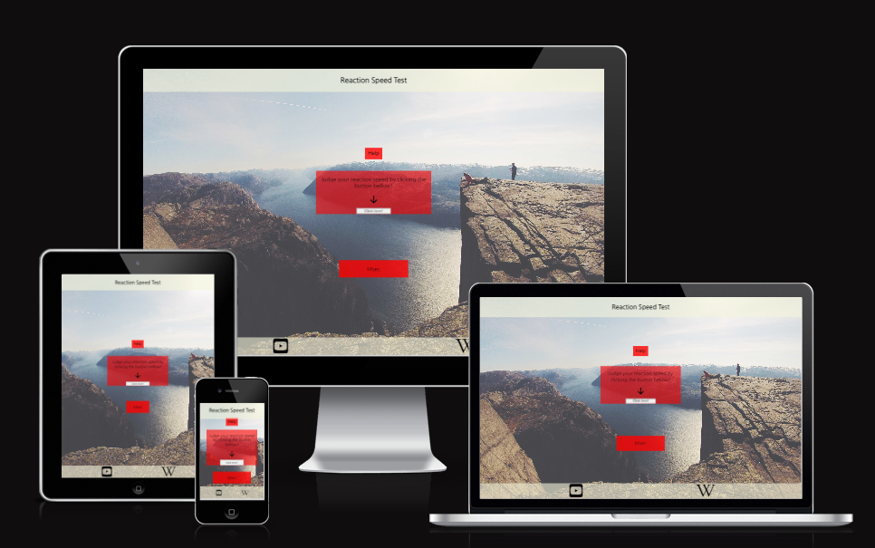
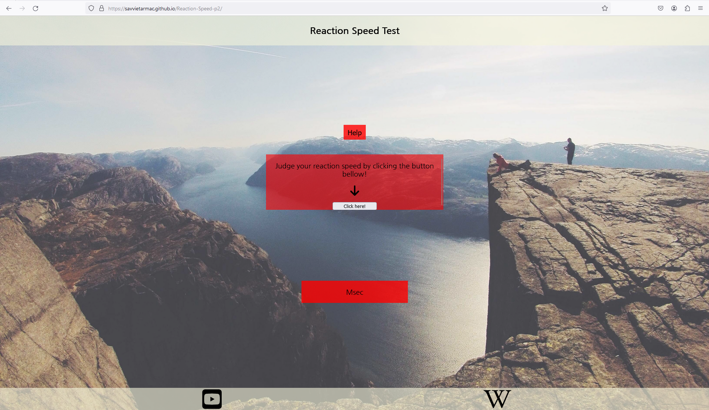
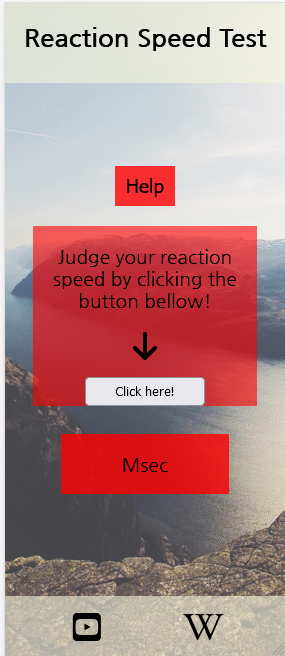

# Reaction Speed Webpage *new*
The Reaction Speed website is made for anyone who is intrested in learning about how fast their reaction speed is.

[Reaction Speed](https://github.com/Savvietarmac/Reaction-Speed.p2)

## User Stories *new*

 |Story no. |Story|
 | -------- | -------- |
 |1|As a new user,  I want to learn what my reaction speed is So that i can understand how fast my reactions are  I know i am done when the user can use the click here button to do this.|
 |2|As a new user, I want to be able to see what my reaction speed is So that i can see how fast i am  I know i am done when the user can use the website to see the score.|
 |3|As a new user, I want to learn how to use the websites test So that i can learn how the test is done  I know i am done when the user has a help button to do so.|
 |4|As a user, I want to see what my reaction speed was So that i can see how fast am and compare it to how fast i was before  I know i am done when the user can use the score button to do this.|

 ***

## Wireframes *Done*
Bellow are my early designs for the reaction speed web project.

### Index Page
##### Widescreen

##### Phone

### Start Of Test
##### Widescreen

##### Phone

##### changes
- Ended up creating a score page.
- Added a sidebar for keeping instant returns on the users test score.

***

## Features *almost done*

 ##### Header
 - Header has the name of the website.
 

 ##### Footer
 - Has links to further resources.
 

 ##### Nav
 - Right button uses a javascript alert to instruct on the test in index and explains the content in score.html.
 - Left button goes between index.html and score.html.
 

##### Test Area
 - Has a button used to start the test
 - It then changes to other colors whereby the user can click on two of them
 - yellow returns the user to the begining
 - green records the users reaction speed
 

##### Colors
  - Colors for the website are:
  - rgba(255, 0, 0, 0.8)
  - rgb(0, 0, 0)
  - rgb(0, 128, 0)
  - rgb(255, 255, 0)
  - rgba(245, 245, 220, 0.6)

##### fonts
  - fonts from google fonts [font](https://fonts.google.com/specimen/Nanum+Gothic?query=sand)

##### Index
  - Header at the top
  - Footer at the bottom
  - Nav to the sides by the top
  - Start button in the center
  - Hero image in the background
 

 ##### Score *need more*
 - Has a ol where earlier scores are stored
 - 
 - 

***

## Testing *Need to do*

### validator Testing *Need to do*

 - HTML
    - Index: No errors were found using the official W3C validator https://validator.w3.org/nu/?doc=https%3A%2F%2Fsavvietarmac.github.io%2Fp1-star-views%2Findex.html
    - Guide: No errors were found using the official W3C validator https://validator.w3.org/nu/?doc=https%3A%2F%2Fsavvietarmac.github.io%2Fp1-star-views%2Fguide.html

 - CSS 
    - No errors were found using the official jigsaw validator http://jigsaw.w3.org/css-validator/validator?lang=en&profile=css3svg&uri=https%3A%2F%2Fsavvietarmac.github.io%2FReaction-Speed.p2%2F&usermedium=all&vextwarning=&warning=1
- Java
    - No errors were found using the official Jshint validator 
    - 
    - 
    - 
    - 
### User Stories Testing *need to do*

 | Story no. | Result | Story/evidence |
 | -------- | -------- | ---------- |
 |1|Test Pass|        |
 |2|Test Pass|       |
 |3|Test Pass|       |
 |4|Test Pass|       | 

### Accessiblity Testing *need to do*

Using lighthouse to rate the accesability of the webpage. Results are:
##### Index
 
##### Guide
 

### Manual Testing *Done*
 - I have tested this website on diffrent web browsers.
 - I have tested that the website is responsive to diffrent screen sizes. It works in multiple diffrent screen sizes.
 - I have tested the links in the nav and the footer. they all work
 - I have tested the text and its fonts are readable and scroll where necessary.

#### Desktop *Done*
|chrome 121.0.6167.139|Firefox 122.0|
| --- | --- |
|||

#### Tablet
|chrome 121.0.6167.139|Firefox 122.0|
| --- | --- |
|||

#### Phone
|chrome 121.0.6167.139|Firefox 122.0|
| --- | --- |
|||

### Fixed Bugs *Done

#### Halved Area
  - In index.html the test area ended up in half often.
  - Choosing to sidestep the issue by hiding p1 along with the test area.

#### Oversized Test Area
  - During development i used min height and min width to fix other issues and the code ended up redundant.
  - Then it started causing sizing issues for the test area in index.html.
  - Discovering why, the code was then removed.

## Deployment *Done*

### Cloning & Forking
#### Fork
1. On GitHub.com, navigate to the [Savvietarmac/Reaction-Speed.p2](https://github.com/Savvietarmac/Reaction-Speed.p2) repository.
2. In the top-right corner of the page, click Fork.
3. By default, forks are named the same as their parent repositories. You can change the name of the 
4. fork to distinguish it further.
5. Add a description to your fork.
6. Click Create fork.

#### Clone
1. Above the list of files click the button that says 'Code'.
2. Copy the URL for the repository.
3. Open Terminal. Change the directory to the location where you want the cloned directory.
4. Type git clone, and then paste the URL
5. Press Enter.

### Local Deployment
1. Sign up to [Gitpod](https://github.io/)
2. Download the Gitpod browser extension.
3. On GitHub.com, navigate to the [Savvietarmac/Reaction-Speed.p2](https://github.com/Savvietarmac/Reaction-Speed.p2) repository. 
4. Above the list of files click the button that says 'Gitpod'.

### Remote Deployment
1. The site was deployed to Github pages. If you have forked/cloned the repository the steps to deploy are:
2. On GitHub.com, navigate to your repository.
3. Navigate to the settings tab.
4. Click on the tab called 'pages' on the left hand side.
5. From the source drop down list under the heading Build and deployment, select main.
6. The page will then provide the link to the website.

The live link can be found here - [Reaction Speed](https://savvietarmac.github.io/Reaction-Speed.p2/)

***

## Credits *Done*
  - used [w3schools](https://www.w3schools.com/) for tips on how to code my project

#### Images
 - Hero image made by Snapwire [Pexels](https://www.pexels.com/photo/adventure-cliff-lookout-people-6763/)

#### Icons
 - Favicons taken from [Favicon](https://favicon.io/favicon-converter/)
